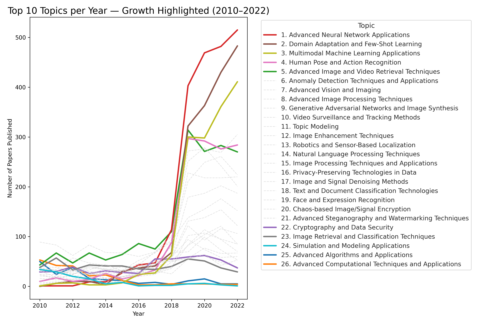

# TrendGraph: Academic Research Trends using Knowledge Graphs

 For a full technical explanation of the project, refer to the portfolio document available [here](docs/Portfolio.png).

## Steps Overview

1. **Data Preprocessing**  
    The script [`preprocess.py`](src/preprocess.py) is used to fetch and preprocess data from OpenAlex. This step prepares the raw data for graph construction and saves it in a json format ([`openalex_research_papers.json`](data/openalex_research_papers.json)).
    > **Warning**: Downloading all the data from OpenAlex can take a significant amount.

2. **Graph Construction**  
    Using Neo4j as the graph database, we build a knowledge graph from the preprocessed data. This step involves defining nodes, relationships, and properties. The script used is [`build_graph.py`](src/build_graph.py).

3. **Graph Queries**  
    Various queries are performed on the graph to extract insights and analyze the data ([`queries.py`](src/queries.py))

4. **Machine Learning Algorithms**  
    - **KNN and KMeans**: Implemented in [`similarities.py`](src/similarities.py) and [`clusters.py`](src/clusters.py) to analyze similarities and cluster data.  
    - **Graph Convolutional Network (GCN)**: The script [`gnn.py`](src/gnn.py) trains a GCN to predict the number of citations of a paper. The model uses embeddings from the paper's abstract and the publication year as features.

## Outputs

All outputs from the above steps are stored in the [`output`](output) folder for easy access and analysis.

## Highlights

- **Visualizing Research Trends**  
  The graph allows us to visualize research topic trends effectively. For example:  
  

- **GCN Predictions**  
  The GCN model provides [example predictions](output/example_predictions.txt) for the number of citations, showcasing the potential of graph-based learning.

---
This project demonstrates the power of knowledge graphs and machine learning in understanding and predicting trends in research data.
